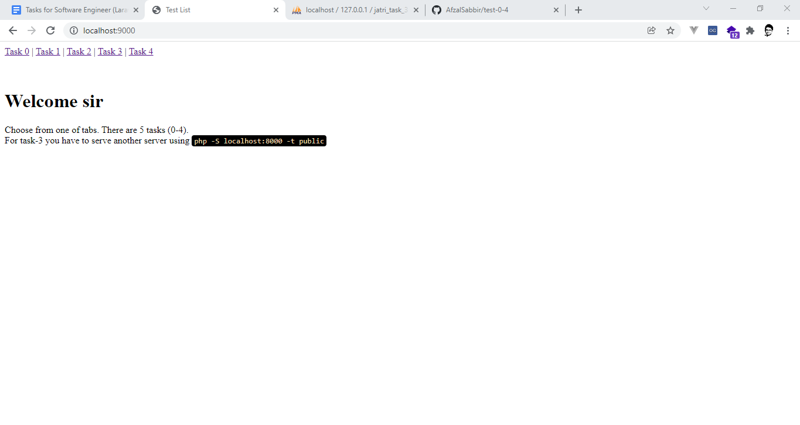

#Run
```php -S localhost:9000``` in root directory

#Select one of task
<b> Task 0 | Task 1 | Task 2 | Task 3 | Task 4 </b>

[
**_Note_**: For task-3 you have to serve from the task-3 root directory _(test-0-4/task-3)_
<br>
Command: ```php -S localhost:8000 -t public```
]

Check this video of working [[click here]](https://drive.google.com/file/d/11ovdJxVFVw5f0YWslUJ-vgfNVw_iwTZH/view)

